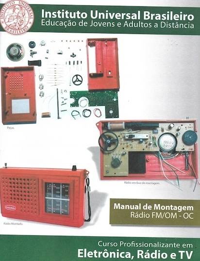

# Modificando o rádio do “Curso Profissionalizante em Eletrônica, Rádio e TV” do Instituto Universal Brasileiro 

## Objetivos do projeto

O projeto propõe converter o rádio oferecido pela IUB, originalmente baseado no DSP Si4825, em um modelo aprimorado com o DSP Si4827. A transição para o Si4827 traz a vantagem de agregar funcionalidades tanto analógicas quanto digitais, oferecendo maior versatilidade e desempenho. Para potencializar a experiência do usuário, será incorporado um display OLED para a exibição clara e moderna da frequência e outros parâmetros do rádio, melhorando a interface visual.

O controle do sistema será realizado por um microcontrolador, com a possibilidade de utilizar um Arduino Pro Mini 3.3V ou o LGT8F328, uma alternativa mais eficiente e econômica ao Arduino tradicional. Essa escolha garante compatibilidade e flexibilidade no desenvolvimento, além de permitir a personalização do firmware para explorar ao máximo as capacidades do DSP Si4827.

Essa modificação não apenas moderniza o rádio, mas também apresenta um excelente projeto de aprendizado, unindo conceitos de eletrônica analógica, digital e programação embarcada. Com a integração de tecnologias atuais, o rádio passa a ser uma ferramenta prática para explorar temas como protocolos de comunicação (em especial I2C), design de interfaces e otimização de circuitos, além de ampliar as possibilidades de personalização para futuros projetos.

Como objetivo secundário, este projeto busca capacitar o hobbista ou estudante de eletrônica a adaptar e converter outros receptores comerciais baseados no Si4825, ampliando suas funcionalidades e incorporando tecnologias mais modernas. Essa proposta visa não apenas aprimorar o conhecimento técnico do participante, mas também fomentar a experimentação e a criatividade na modificação de equipamentos eletrônicos.

## Contextualização

O Instituto Universal Brasileiro – IUB é uma instituição de ensino à distância pioneira no Brasil, fundada em 1941, conhecida por oferecer cursos práticos e acessíveis. O curso “Profissionalizante em Eletrônica, Rádio e TV” capacita os alunos nas áreas de eletrônica básica, manutenção de rádios, televisores e outros equipamentos eletrônicos, combinando teoria e prática. É voltado para quem busca uma formação técnica bem como para interessados em eletrônica.  

Além de oferecer um excelente material teórico que explica de forma clara e acessível os conceitos fundamentais de eletrônica, bem como detalha os principais componentes utilizados em projetos, o curso também proporciona uma rica experiência prática. Os alunos têm acesso a conteúdos aplicados por meio de ferramentas e kits exclusivos, que permitem a aplicação direta do conhecimento adquirido. Um dos destaques do curso é a montagem de um receptor multibanda, capaz de sintonizar estações de rádio em FM, OM e OC. Essa abordagem prática não apenas reforça o aprendizado teórico, mas também desenvolve habilidades essenciais para projetos eletrônicos reais, preparando os alunos para atuar de maneira eficaz no mercado técnico.

Em relação ao Instituto Universal Brasileiro (IUB), gostaria de contextualizar como cheguei até este curso à distância. Sou formado em Sistemas de Informação e, há alguns anos, retomei o hobby da eletrônica, uma atividade que pratiquei intensamente durante minha adolescência. Naquela época, nos anos 1970, os cursos por correspondência em eletrônica não eram tão acessíveis para mim. No entanto, tive a oportunidade de acompanhar de perto alguns cursos feitos por amigos que também compartilhavam a paixão por eletrônica.
Esses amigos frequentemente compartilhavam seus experimentos e materiais didáticos, e eu ficava fascinado pela clareza e eficiência com que os conteúdos eram apresentados. Mesmo sem ser aluno, conseguia compreender os conceitos abordados e me sentia motivado a interagir sobre projetos de eletrônica em geral. Aquela experiência plantou em mim uma admiração duradoura pelo formato de ensino à distância, que não apenas tornava o aprendizado acessível, mas também incentivava a troca de ideias e a prática criativa entre os entusiastas da eletrônica. 

Nos anos 1980, 1990 e 2000, descobri uma nova paixão e trilhei uma carreira bem-sucedida na área da computação, na qual me formei e me especializei. Minha trajetória profissional esteve focada principalmente em programação, análise de sistemas e bancos de dados. Em algumas ocasiões, trabalhei com programação de baixo nível, utilizando linguagens como Assembly e C/C++. Posso afirmar que os conceitos e a abordagem experimental que aprendi nos anos 1970 tiveram um impacto significativo no meu desenvolvimento profissional, contribuindo para minha compreensão técnica e resolução de problemas.
Já na década de 2010, decidi retomar o hobby da eletrônica e, em 2021,  iniciei um programa de Mestrado em Tecnologia Educacional, concluído em 2023. Durante o mestrado, mergulhei em diversas teorias de aprendizagem e aquisição do conhecimento, como metodologias ativas, aprendizagem significativa, construtivismo e construcionismo, a prática reflexiva  entre outras. Esses estudos me levaram a revisitar com um olhar renovado os cursos de eletrônica dos anos 1970, que tanto me marcaram. Inspirado por essa redescoberta, decidi adquirir o curso "Profissionalizante em Eletrônica, Rádio e TV" do Instituto Universal Brasileiro, unindo o fascínio pelo aprendizado prático à minha paixão pela eletrônica. 

Ao revisitar os cursos que acompanhei nos anos 1970, agora com um olhar mais acadêmico sobre a abordagem de ensino, muito mais do que o conteúdo em si, pude confirmar a eficácia desse modelo de ensino. Ele não apenas transmitia conhecimento de forma clara e prática, mas também incentivava a experimentação e o aprendizado ativo, características que inspiraram o desenvolvimento das minhas próprias sequências didáticas, utilizadas no trabalho de pesquisa de campo do meu mestrado.

Embora essa contextualização pudesse facilmente se transformar em um tema para um estudo mais aprofundado, é hora de focar no objetivo principal deste projeto: **modificar o rádio oferecido pelo Instituto Universal Brasileiro para torná-lo ainda mais funcional e versátil**.

## Sobre o Si4825 e o rádio do IUB 

O rádio do curso "Profissionalizante em Eletrônica, Rádio e TV" do IUB tem como coração o **DSP Si4825**, um componente que praticamente implementa um rádio completo com poucos componentes externos. Amplamente usado por fabricantes, o **Si4825** é o principal elemento em muitos rádios modernos, incluindo modelos de aparência vintage encontrados no mercado.

Segundo o datasheet do fabricante, o Si4825 é um IC receptor de rádio AM/FM/SW digital CMOS com ajuste mecânico básico. Ele integra todas as funções de recepção, da antena à saída de áudio, e pertence à família de sintonizadores multibanda da Silicon Laboratories. Compacto, com baixo consumo de energia e exigindo um circuito simples, o Si4825 elimina ajustes manuais na fabricação, sendo ideal para rádios eficientes que combinam o ajuste digital com o mercado de rádios analógicos. 

### Características do Si4825 

- Suporte à banda FM (64-109 MHz)  
- Suporte à banda AM  (504-1750 kHz)  
- Suporte à banda SW (2.3-28.5 MHz)  
- Não requer calibração manual  
- Saída de áudio mono  
- Configuração de bandas conforme a região AM/FM/SW  
- Cobertura aprimorada das bandas FM/SW  

O projeto do rádio oferecido pelo IUB, embora eficiente, não aproveita todo o potencial do Si4825, particularmente em relação às bandas de Ondas Curtas, que podem cobrir uma ampla faixa de 2.3 a 28.5 MHz. O rádio do curso é configurado apenas para a banda de 25 metros (11.6–12.1 MHz), o que pode limitar a experiência de entusiastas que desejam explorar uma maior diversidade de frequências nessa modalidade de recepção.

Entretanto, como recurso didático, o rádio atende plenamente ao objetivo do curso, proporcionando uma base sólida para o aprendizado em eletrônica. Essa abordagem prática estimula os estudantes a aplicarem o conhecimento adquirido para modificar e expandir o projeto original, caso desejem explorar novas possibilidades e maximizar o uso do dispositivo.

As figuras a seguir apresentam o rádio para mantage oferecido pelo IUB aos seus estudantes.

A figura a seguir apresenta o Si4825 montado  na placa do rádio do IUB.

As figuras a seguir apresentam placa de circuito impresso do rádio do IUB

**Importante:** Este trabalho concentra-se exclusivamente no componente principal do rádio, o DSP, e não aborda detalhes relacionados às etapas de amplificação de áudio ou ao front-end, como antenas e filtros. Esses elementos, embora essenciais para o funcionamento completo do receptor, estão fora do escopo deste projeto.

Como será detalhado posteriormente, a substituição do Si4825 pelo Si4827 mantém grande parte da arquitetura original do receptor, aproveitando ao máximo o design existente. As modificações necessárias envolvem apenas ajustes na placa de circuito impresso, como o corte de algumas trilhas, para permitir a integração do Si4827 com o Arduino Pro Mini 3.3V ou um microcontrolador equivalente. Essa abordagem minimiza alterações estruturais, tornando a atualização prática e eficiente.

## Sobre o SI4827 

Segundo o datasheet do fabricante,  o Si4827 é um IC receptor de rádio AM/FM/SW digital CMOS com ajuste analógico e exibição digital, projetado para aplicações de entrada, que integra todas as funções do receptor, desde a entrada da antena até a saída de áudio. Quando utilizado com um microcontrolador host (interface de controle de 2 fios compatível com I2C), permite que as informações de frequência sejam exibidas em um display LCD, preservando as características de ajuste analógico.
O Si4827 oferece uma cobertura aprimorada das bandas FM e SW, além de suportar a recepção de áudio de canais de TV da China na banda FM, tornando-o versátil em diferentes cenários de uso. Seu algoritmo de controle superior proporciona uma interface de controle fácil e confiável, eliminando a necessidade de componentes externos ajustados manualmente, comuns em soluções tradicionais.
Essa integração entre o Si4827 e um microcontrolador, como o Arduino Pro Mini 3.3V ou equivalente, abre possibilidades interessantes para o aprendizado e a personalização de projetos de rádio. Permite, por exemplo, modernizar receptores analógicos, adicionar funcionalidades digitais como exibição de frequência e controle automático, e explorar conceitos de eletrônica embarcada, fazendo deste componente uma excelente escolha para hobbistas e estudantes interessados em combinar o clássico e o moderno em eletrônica.

**Características do Si4827**  

- Suporte à banda FM  (64-109 MHz)  
- Suporte à banda AM  (504-1750 kHz)  
- Suporte à banda SW (2.3-28.5 MHz)  
- Suporte selecionável para todas as bandas regionais AM/FM/SW  
- Cobertura aprimorada das bandas FM/SW  
- Interface de controle de 2 fios (I2C)  
- Saída mono  
- Indicador de estação válida  
- Suporte para controle de volume digital  
- Suporte para ajuste de graves e agudos (Bass/Treble)  
- Componentes mínimos, sem necessidade de calibração manual  
- Excelente desempenho em condições reais  
- Recepção de áudio de canais de TV da China na banda FM  
- Tensão de alimentação de 2,0 a 3,6 V  
- Suporte para uma ampla gama de antenas de bastão de ferrite e loop de ar  

## Circuito original do rádio da IUB (com o SI4825)

O esquema a seguir representa o projeto original do rádio. Ao analisar o circuito com o Si4825, é possível observar que os pinos 10 e 11 estão conectados ao terra, enquanto os pinos 5 e 1 permanecem flutuantes (sem função). Na modificação para o Si4827, esses pinos ganham novas atribuições: os pinos 1, 10 e 11 serão configurados para desempenhar funções essenciais na comunicação com o microcontrolador, ampliando as capacidades e funcionalidades do sistema.
** Note também que o "X" destacado em vermelho indica os pontos onde será necessário cortar as trilhas correspondentes na placa de circuito impresso. Esse procedimento será detalhado nas próximas etapas para garantir a correta implementação das modificações.**

## Circuito modificado do rádio da IUB para receber o Si4827

No circuito apresentado a seguir, os destaques em vermelho indicam claramente os pontos de conexão do microcontrolador ao sistema, orientando a integração de forma precisa e funcional.

No esquema apresentado anteriormente, nenhuma modificação foi feita no front-end do rádio. No kit oferecido pelo IUB, conforme ilustrado no circuito, a seleção da antena é feita pela chave de banda. Ou seja, ao mesmo tempo que a chave define a banda a ser utilizada pelo Si4825 (FM, AM ou OC), ela também seleciona a antena correspondente. No circuito modificado, essa funcionalidade continuará sendo gerenciada pela chave mecânica original.

Isso significa que, para ouvir ondas médias ou ondas curtas, será necessário ajustar manualmente a chave localizada na traseira do rádio para a posição correta, garantindo uma recepção de qualidade. Automatizar esse processo demandaria a adição de outros componentes, o que aumentaria significativamente o custo e a complexidade do projeto, indo além do objetivo de simplicidade e acessibilidade proposto.

### Si4825 soldado na placa do rádio (projeto original)

### Si4827 soldado na placa do rádio (projeto modificado) 

